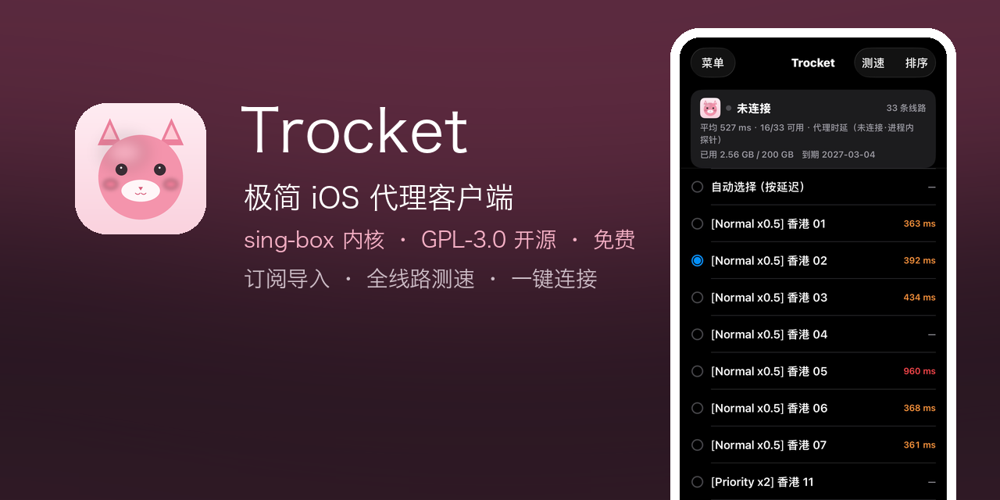
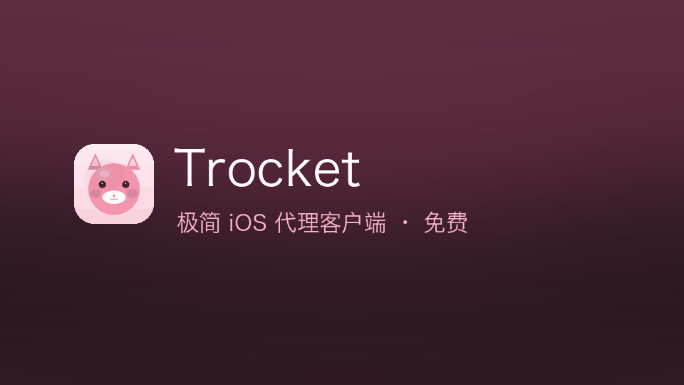

# Trocket




面向 iOS 的极简代理客户端：导入订阅、测量线路延迟、选择线路并建立系统级 VPN 连接。
网络核心使用 [sing-box](https://github.com/SagerNet/sing-box) 的 `libbox`（v1.14.2），
不自行实现任何代理协议；界面为单屏结构。

- 本应用不提供任何服务器或节点，需要使用者自备订阅链接。
- 与 SagerNet、sing-box、Shadowrocket 等项目均无关联，也不表示其作者对本项目的认可。

## 功能

- **订阅导入**：按内核标识拉取订阅，兼容 sing-box JSON 与 Clash YAML
- **线路列表**：展示全部线路及其倍率标识，显示订阅用量与到期时间
- **延迟测量**：未连接状态下亦可测量全部线路延迟，支持按延迟排序
- **连接控制**：开关控制系统 VPN 配置；连接状态下切换线路无需重新拨号
- **国内直连**：内置 `geosite-cn` / `geoip-cn` 规则集，国内域名与 IP 自动直连；
  订阅里的远端规则集在导入时缓存进 App Group 容器并改写为本地引用（见 `Sources/Shared/RuleSetStore.swift`）
- **路由模式**：菜单内可切「规则 / 全局」，走内核 Clash 模式，切换不断线
- **本地优先**：配置与订阅信息仅保存在设备本地，离线可用；不集成统计与崩溃上报 SDK

有意不实现的能力（见 `.specify/memory/constitution.md` 第 II 条）：
规则编辑器、多订阅管理、自定义分流、macOS / tvOS / Android 版本。

## 演示



演示视频：[readme-hero.mp4](docs/assets/readme-hero.mp4)

## 系统要求

| 项目 | 要求 |
|---|---|
| 系统 | iOS 15 及以上 |
| 账号 | 付费 Apple 开发者账号（网络扩展能力必需） |
| 验证 | 真机；网络扩展无法在 iOS 模拟器运行 |

## 架构

```
┌─────────────────────── App（Trocket） ───────────────────────┐
│  SwiftUI 单屏：状态卡 / 线路列表 / 连接开关                    │
│  SubscriptionService ──► 拉订阅(UA: sing-box/1.14.2)          │
│                         识别 sing-box JSON 或 Clash YAML       │
│                         整形(替换 inbounds) ──► profile.json   │
│  TunnelController ──► NETunnelProviderManager（系统 VPN）      │
│  ControlChannel ──► LibboxCommandClient ─┐                    │
└──────────────────────────────────────────┼────────────────────┘
                    App Group 容器          │ unix socket: command.sock
        profile.json / subscription.json    │
┌──────────────────────────────────────────┼────────────────────┐
│  Network Extension（TrocketTunnel）       ▼                    │
│  PacketTunnelProvider ──► LibboxSetup + LibboxCommandServer    │
│                        └─► libbox 服务（AnyTLS 等协议 + TUN）  │
│  TunnelPlatformInterface ──► openTun（NEPacketTunnelNetwork）  │
└───────────────────────────────────────────────────────────────┘
```

设计取舍与实测证据见 `specs/001-ios-vpn-client/research.md`，接口契约见
`specs/001-ios-vpn-client/contracts/`。

## 目录结构

```
Sources/Shared/   两个 target 共用：配置迁移与整形、订阅解析、状态模型（无 libbox 依赖，可单测）
Sources/App/      主 App：订阅服务、隧道控制、命令通道、进程内探针、单屏 UI
Sources/Tunnel/   网络扩展：libbox 启动、平台接口、TUN 文件描述符获取
Tests/            单元测试
scripts/          内核构建、工程生成、验证、分发、App Store Connect 工具
promo/            宣传素材生成脚本与产物
specs/            spec-kit 产物（spec / plan / research / contracts / verification / tasks）
docs/appstore/    商店用隐私政策与支持页面
```

## 构建

```bash
brew install go xcodegen
./scripts/build-libbox.sh     # 首次约 10–20 分钟，产出 Vendor/Libbox.xcframework
./scripts/bootstrap.sh        # 生成 Trocket.xcodeproj（自动探测 Team ID）
open Trocket.xcodeproj
```

`Vendor/Libbox.xcframework` 由源码构建产出，不纳入版本控制。换账号或换机器时，
以环境变量覆盖默认配置：`TEAM_ID=... BUNDLE_PREFIX=... ./scripts/bootstrap.sh`。

两点构建约束：

- 内核默认不编译 naive 出站：它会引入 Chromium Cronet（每架构切片约 42MB，并引用 App Extension
  中不存在的 `UIApplication`）。AnyTLS / Shadowsocks / VMess / VLESS / Trojan / Hysteria2 /
  TUIC / WireGuard 不受影响；确有需要时使用 `INCLUDE_NAIVE=1 ./scripts/build-libbox.sh`。
- 服务端若下发 1.11/1.12 时期的旧版语法，启动前会迁移到 1.14（DNS、注册项、入站字段、
  规则集、出站 ALPN 等），规则与回归用例见 `Sources/Shared/ConfigMigration.swift` 与 `Tests/`。
- 分流规则集一律落到本地再交给内核：远端 `rule_set` 在**服务启动时**下载，失败即 FATAL（实测），
  所以内置 `geosite-cn` / `geoip-cn` 作离线保底，其余远端规则集由主 App 在导入时下载进
  App Group 容器（`Resources/RuleSets/`、`Sources/Shared/RuleSetStore.swift`）。
  拿不到的规则集才会摘除，并在界面提示。

## 测试与验证

```bash
./scripts/verify.sh      # 设备 SDK 编译 + 模拟器单元测试
./scripts/verify-ui.sh   # 仿真器界面用例（XCUITest），截图导出到 build/ui-shots/
```

真机连接、测速与切换需按 `specs/001-ios-vpn-client/quickstart.md` 第 3 节人工复验；
网络扩展在模拟器中无法运行，模拟器仅用于界面检查与单元测试。
`verify-ui.sh` 会把 entitlements 覆盖成「只有 App Group」——仿真器拒绝启动带
`packet-tunnel-provider` 能力的包（实测 POSIX 163）。

## 分发

| 场景 | 命令 |
|---|---|
| 内部分发（OTA，设备需登记 UDID） | `TEAM_ID=... BUNDLE_PREFIX=... ./scripts/make-ota.sh` |
| App Store / TestFlight | `APPSTORE_API_ISSUER_ID=... ./scripts/upload-testflight.sh` |
| 商店元数据与截图 | `ASC_KEY_ID=... ASC_ISSUER=... python3 scripts/asc.py status \| screenshots <目录>` |
| 宣传素材（1290×2796 截图、动图、视频） | `python3 promo/make_promo.py` |

App Store Connect 的 Key ID、Issuer ID 与私钥 `.p8` 一律通过环境变量或本机
`~/.appstoreconnect/private_keys/` 提供，不写入仓库。

## 安全与隐私

- 订阅链接等同账号凭证，仅写入本机 App Group 容器，不上传任何第三方。
- 诊断日志仅保存在设备本地，可由使用者一键复制或清除。
- 不集成广告、统计或数据分析 SDK，不含内购。

## 合规与许可

本项目以 **GPL-3.0-or-later** 分发（因其链接 GPL-3.0 的 sing-box）。
向他人分发编译产物（含 `.ipa`）时须同时提供本仓库完整源码。
第三方组件清单与商标声明见 `THIRD_PARTY.md`。

## 文档索引

| 文档 | 内容 |
|---|---|
| `specs/001-ios-vpn-client/spec.md` | 功能需求与非目标 |
| `specs/001-ios-vpn-client/plan.md` | 技术方案与阶段划分 |
| `specs/001-ios-vpn-client/research.md` | 关键技术取舍与实测证据 |
| `specs/001-ios-vpn-client/contracts/` | 订阅拉取与隧道控制契约 |
| `specs/001-ios-vpn-client/quickstart.md` | 构建、运行与真机复验步骤 |
| `specs/001-ios-vpn-client/verification/` | 自动验证与真机验证记录 |

## 联系方式

支持与反馈：forwoshitjy@live.com
